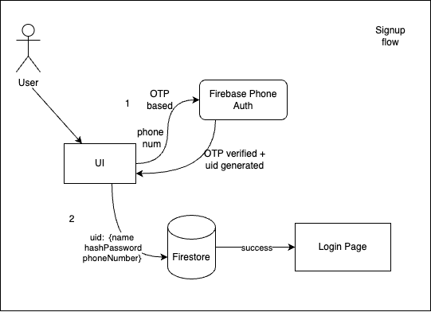
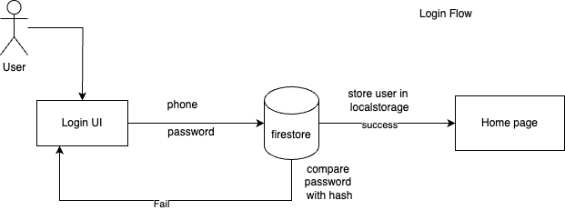
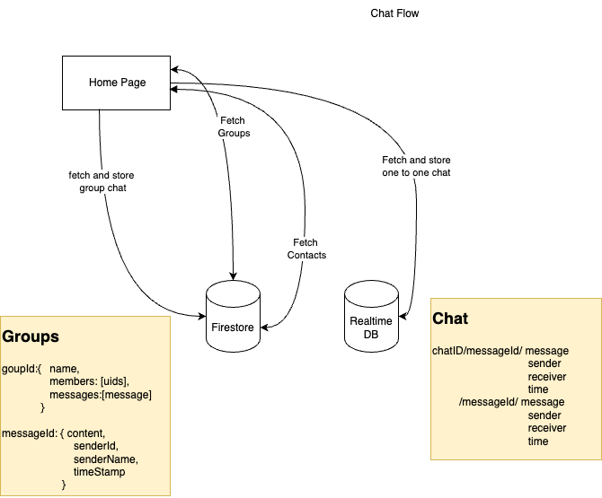

# Chat Application

This is a Real-Time Chat Application developed using React, Tailwind CSS, and Firebase. It supports both one-to-one chats and group chats with features like user authentication, real-time messaging, and group creation. The application is designed to be responsive and provides a modern user interface.

## Features

- User Authentication: Sign up and login using PhoneAuth (Mobile Number Authentication) with Firebase.
- One-to-One Chat: Real-time messaging between two users.
- Group Chat: Real-time group chat with the ability to create and join groups.
- Real-time Updates: Messages and group updates are stored in Firebase Realtime Database, ensuring instant updates across users.
- Responsive Design: Built with Tailwind CSS, the app adapts seamlessly to both mobile and desktop screens.

## Tech Stack

- Frontend: React, TypeScript, Tailwind CSS
- Authentication: Firebase PhoneAuth Provider
- Database: Firebase Realtime Database (for storing messages)
- Cloud Storage: Firebase Firestore (for storing user data)
- Icons: React Icons

## System Design




## Steps to Run

1. Clone the repository:

```bash
git clone https://github.com/dharmik3/chat.git

cd chat
```

2. Install dependencies:

```bash
yarn add
```

3. Configure firebase project

- Replace in services/firebaseCongig.ts

```bash
firebaseConfig={} object with your setuped project on firebase
```

4. Create .env at root level of your project and Add

```
VITE_API_KEY=<Your Firebase API KEY>
```

5. Run

```bash
yarn run dev
```
